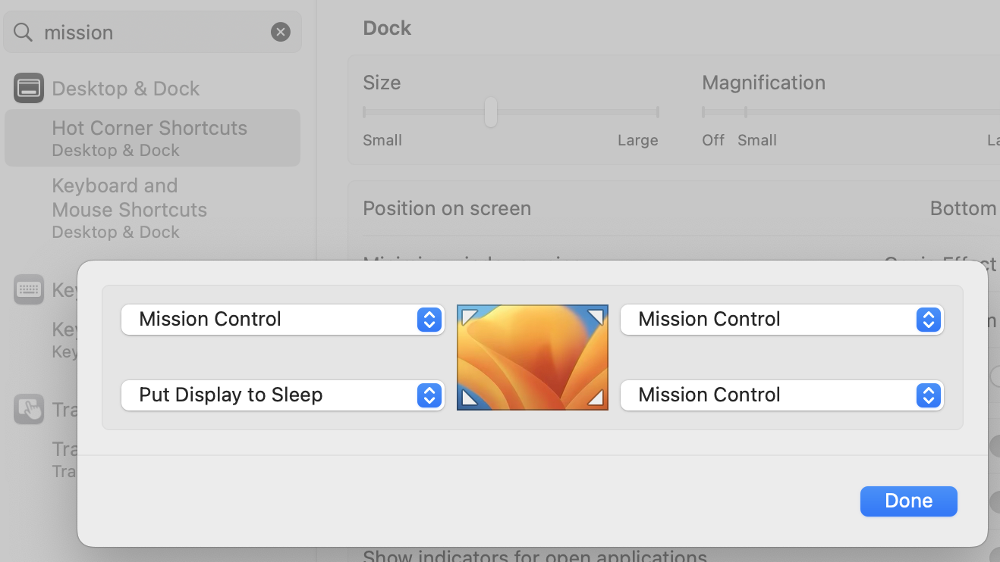

# Mac OS X keyboard shortcuts, and other tips/tricks

(Install and start [KeyCastr](https://github.com/keycastr/keycastr) if demo'ing keyboard shortcuts; shows keystrokes onscreen.)

## First things...
- ⌘-SPC (spacebar), "sys", RETURN, and then search in System Settings for "customize modifier"
- Map Caps Lock to ESC.  This will come in handy when you learn vim (you're going to learn Vim, of course ... ? 😃) Also, ESC cancels modal dialogs of various kinds, such as ⌘-SPC (Spotlight search).

### In System Settings, search "mission", choose "Hot Corner Shortcuts"
[Mission Control](https://support.apple.com/en-us/HT204100) - bird's-eye view of windows, spaces, and apps
I set my hot corners to something like this...

When you touch that screen corner with your mouse, the selected action happens.

Other "Mission Control" settings:
- OFF - "When switching to an app, switch to a space w/open windows"
- OFF - "Displays have separate Spaces"

## General Keyboard Shortcuts

- ⌘-SPC - Spotlight. Search for anything on your Mac: apps, text, filenames, etc.
    - What to search for?
        - "ter" - Terminal.app - Sometimes just "t" is enough; Spotlight remembers frequency.
        - "sys" - System Settings.app

- ⌘-TAB - Cycle between open apps. (⌘-SHFT-TAB goes the other way).
- ⌘-n - New window in an app (e.g., new bash window in Terminal, new browser window in Chrome, new Finder window in Finder).
- ⌘-w - Close active window in an app (e.g. a tab in your browser).
- ⌘-` - Cycle between windows in an app.
- ⌘-, - Open an app's settings (aka preferences).
- ⌘-CTRL-SPC - Open the characters menu (emojis, symbols, etc.)
### Capturing Screenshots
**Selecting and capturing a portion of the screen**
- ⌘-SHFT-4 - Drag the crosshair to select.  Selected area is saved in a file on your Desktop.
- ⌘-SHFT-Ctrl-4 - Drag the crosshair to select.  Selected area is saved to your copy buffer (paste with ⌘-v).

**Selecting and capturing a window**
- ⌘-SHFT-4, then SPC - When you tap SPC, the crosshair changes to a camera.  The active window is saved in a file on your Desktop.
- ⌘-SHFT-Ctrl-4, then SPC - When you tap SPC, the crosshair changes to a camera.  The active window is saved to your copy buffer.

### Editing
- ⌘-c - Copy selected
- ⌘-v - Paste selected
- ⌘-x - Delete selected
- ⌘-z - Undo

## App-specific shortcuts

### Finder shortcuts
- ⌘-SHFT-n - New folder at top of hierarchy in current Finder view.
- ⌘-BKSPC - Delete highlighted item (e.g. a file).  BE CAREFUL!
- \<right-arrow> - Expand directory view.
- ⌘-\<down-arrow> - Zoom Finder view to highlighted sub-directory.
- ⌘-\<up-arrow> - Unzoom Finder view up on directory level.

### Browser shortcuts
- ⌘-+ - Increase font size.
- ⌘-MINUS - Decrease font size.
- ⌘-0 - Restore default font size.
- Ctrl-TAB - Cycle between tabs in active window.
- You can drag a tab out into its own window (and drag it back in too).

### [Mission Control](https://support.apple.com/en-us/HT204100) - bird's-eye view of windows, spaces, and apps

- When in Mission Control, add a workspace with "+" (top right corner)
- Ctrl-\<up-arrow>
- Ctrl-\<right-arrow>, Ctrl-\<left-arrow> - switch workspaces
- Ctrl-\<down-arrow> - app focus

While in Mission Control, you can drag windows around to various desktops.

To delete a desktop, hover over its thumbnail until a white "X" appears, and click the "X".  (No windows in that desktop will be deleted; they will simply move to the previous desktop).

Hit ESC to exit Mission Control.

## Gestures
In System Settings, search "gestures", choose Trackpad gestures.

Trackpad with drag lock:
- "use trackpad for dragging"
- "with Drag Lock"

### Terminal.app (zsh)
- Tab to autocomplete file or directory names.
- ⌘-k - Clear screen, including scrollback history.
- ⌘-\<double-tap> on a URL in the terminal window - Opens that URl in default browser.
- ⌘-TAB - Open a new shell in the same window.
  - Ctrl-TAB - Cycle between tabs (similar to behavior with browser tabs).
  - You can drag a tab out into its own window (also like browser tab, except that you can't drag it back in).

### Explore
- Trackpad has "light" click and "firm" click (aka "force click").
- Function keys can be set to default to F1-12, or to the "other" mode (FN-\<fn-key> accesses whatever the "other" mode is.  ⌘-SPC, "function keys".
